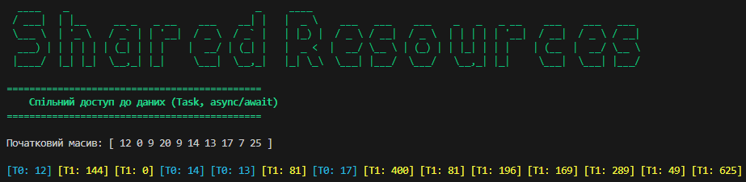

# Shared Resources Showcase: .NET Concurrency

Цей проєкт демонструє роботу з **спільними ресурсами** у багатопотоковому середовищі за допомогою сучасного стеку .NET. Два паралельні завдання одночасно звертаються до одного й того самого статичного масиву даних, виконуючи різні операції.

Програма реалізована мовою C# з використанням сучасних механізмів **Task Parallel Library (TPL)** та `async / await`, а також базових механізмів синхронізації (`lock`) для коректного та безпечного виводу в консоль.

## 📝 Опис

Програма генерує масив з 10 випадкових чисел (0..25).
Два завдання (`Task`) працюють паралельно:
- **Завдання T0 (Cyan):** Шукає та виводить числа, що відповідають умові `10 < x < 20`.
- **Завдання T1 (Yellow):** Обчислює та виводить **квадрати** всіх елементів масиву.

### ⚙️ Технічні особливості
- **Спільний ресурс:** Масив даних `int[]`, який генерується окремим сервісом та передається у `ConcurrencyProcessingService` через параметри, повністю уникаючи використання глобальних (`static`) змінних. Це відповідає принципам Clean Architecture.
- **Thread Safety:** Використано конструкцію `lock`, щоб потоки не "перебивали" один одного під час виводу кольорового тексту в консоль.
- **TPL & Asynchrony:** Використано `Task.Run`, `Task.WhenAll` та `await Task.Delay(150)` для ефективного керування потоками без блокування ОС (замість застарілого `Thread.Sleep`).
- **Гарний UI:** Використано бібліотеку **Spectre.Console** для малювання красивих заголовків та кольорового форматування консолі.

---

## 📸 Результат роботи
Повідомлення від T0 та T1 чергуються, що наочно демонструє конкурентне (паралельне) виконання та потокобезпечний доступ.



---

## 🚀 Як запустити
Вам знадобиться **.NET 8 SDK**.

1. Клонуйте репозиторій:
   ```bash
   git clone https://github.com/Lutvunenko-Dmutro/Lab12-SharedResources-CSharp.git
   ```

2. Перейдіть у папку проєкту:
   ```bash
   cd Lab12-SharedResources-CSharp
   ```

3. Запустіть проєкт:
   ```bash
   dotnet run
   ```

## 🔗 Пов'язані проєкти
- [Async-Showcase](https://github.com/Lutvunenko-Dmutro/Async-Showcase) — Попередній проєкт: основи паралельного виконання незалежних задач (TPL) та бенчмаркінг продуктивності.

-----

© 2026 Dmytro Lytvynenko
