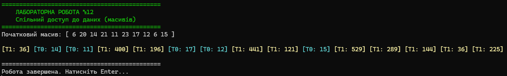

# Лабораторна робота №12: Спільний доступ до ресурсів у .NET

**Тема:** Технології розподілених систем та паралельних обчислень.  
**Виконав:** Студент групи І-23, Литвиненко Дмитро (Варіант 8).

## 📝 Опис
Цей проєкт демонструє роботу з **спільними ресурсами** у багатопотоковому середовищі. Два потоки одночасно звертаються до одного й того самого статичного масиву даних, виконуючи різні операції читання.

Програма реалізована мовою C# з використанням механізмів синхронізації (`lock`) для коректного виводу в консоль.

### 🎯 Завдання (Варіант 8)
Програма генерує масив з 10 випадкових чисел (0..25).
Два потоки працюють паралельно:
- **Потік T0 (Cyan):** Шукає та виводить числа, що відповідають умові `10 < x < 20`.
- **Потік T1 (Yellow):** Обчислює та виводить **квадрати** всіх елементів масиву.

### ⚙️ Технічні особливості
- **Спільний ресурс:** Статичний масив `int[] numbers`, до якого мають доступ обидва потоки.
- **Thread Safety:** Використано конструкцію `lock`, щоб потоки не "перебивали" один одного під час виводу кольорового тексту в консоль.
- **Візуалізація:** Використано `Thread.Sleep(150)` для наочної демонстрації конкурентного виконання.

---

## 📸 Результат роботи
На скріншоті видно початковий масив та результат роботи потоків. Повідомлення від T0 та T1 чергуються, що підтверджує паралельне виконання.



---

## 🚀 Як запустити
Вам знадобиться **.NET 8 SDK**.

1. Клонуйте репозиторій:
   ```bash
   git clone https://github.com/Lutvunenko-Dmutro/Lab12-SharedResources-CSharp.git
